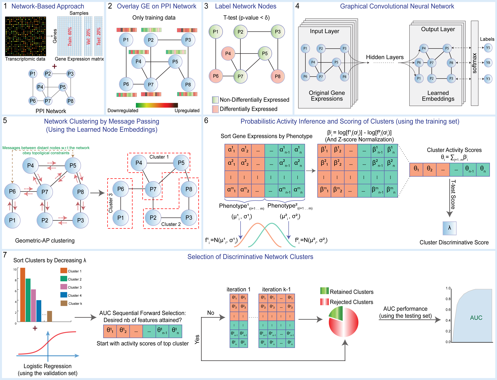

# Graph Convolutional Network for Clustering and Disease Classification

Official implementation of **G**raph **C**onvolutional **N**etwork for **C**lustering and **C**lassification (**GCNCC**).

Omar Maddouri, Xiaoning Qian, and Byung-Jun Yoon, [Deep graph representations embed network information for robust disease marker identification], Bioinformatics, 2021.

**NOTE: The *bash/* folder is intended to reproduce the validation and evaluation experiments from the paper.**

## Installation

```python setup.py install```

## Dependencies

```pip install -r requirements.txt ```

## GCNCC workflow



## Usage
***Note: The validation and evaluation pipelines under the bash/ folder contain files ordered by prefix numbers in the file names for sequential execution.***
1) Download the GitHub repository locally.
2) Create a new folder **data/** with all required sub-hierarchies as indicated in the next steps.
3) Download the PPI network "9606.protein.links.v11.0.txt" or a newer version for homo sapiens from STRING (https://string-db.org/cgi/download.pl) and place it under folder **data/reference/ppi_network/**
4) Download the dataset of interest under **data/raw_input/**
5) For hyperparameter tuning and validation experiments, consider the pipeline under **bash/validation/**
6) For evaluation experiments, consider the pipeline under **bash/process/**

***Note: The output results are saved under data/output/***

## Cite
```
Omar Maddouri, Xiaoning Qian, and Byung-Jun Yoon, "Deep graph representations embed network information for robust disease marker identification", Bioinformatics, Volume 38, Issue 4, 15 February 2022, Pages 1075–1086, https://doi.org/10.1093/bioinformatics/btab772
```
